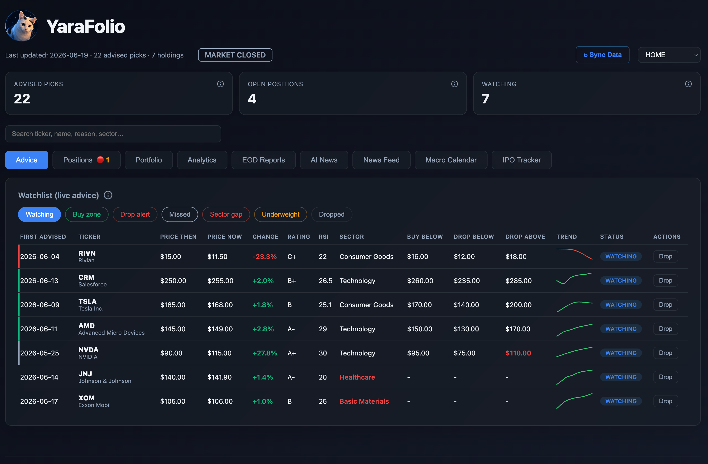

# 📈 YaraFolio

Welcome to **YaraFolio**! I built this because I needed a comprehensive tool where I could combine AI analytics with managing my eToro portfolio. 

Instead of jumping between different apps, YaraFolio acts as a single local dashboard that syncs your eToro trades and organizes your AI-assisted stock research.

> **What is a "Yara"?**
> When thinking of a name for this project, I looked around and Yara was looking at me with her big eyes. As she is my princess, the name was easily found. Yara is my cat. 🐾

---

## 📚 Documentation

- 🛠️ [**Installation & Setup**](docs/SETUP.md): How to clone, configure your API keys, and run YaraFolio.
- 🖥️ [**Dashboard Screens**](docs/SCREENS.md): An explanation of the different tabs (Advice, Positions, Analytics) and features.
- 🔒 [**Demo Mode & Privacy**](docs/DEMO_MODE.md): How YaraFolio uses JSON to keep your data 100% private and sync it to a separate private repository.

---

## 🚀 Architecture
This project uses a lightweight stack without complex build steps or heavy frameworks.
- The Python backend utilizes the standard library (`http.server`) to serve files and handle local API endpoints.
- The frontend is built with vanilla HTML, CSS, and JavaScript, utilizing standard ES6 `<script type="module">`.
- **Minimum Dependency TypeScript**: Instead of compiling `.ts` files (which would require installing npm or pip packages), we use `// @ts-check` and JSDoc annotations in our vanilla JavaScript files. This gives us full TypeScript IDE intellisense and type safety while maintaining the minimum dependency architecture!
- The only external libraries are `marked.js` (for rendering AI markdown summaries) and `Chart.js` (for rendering portfolio graphs). Both are served locally. No web fonts are fetched externally; it relies on the user's native OS sans-serif fonts (Apple System, BlinkMacSystemFont, Segoe UI, Roboto) for a clean, fast UI.

---

## 🤖 The AI "Skills" (And How to Tune Them)

This project is driven by custom agent instructions. When you talk to the AI, it reads these files to know exactly how to fetch data, evaluate stocks, and update your dashboard.

Out of the box, these instructions reflect my personal "oversold bounce" strategy. **You should absolutely tune these to your own liking.**

Here is the breakdown of the available tools:
1. **The Core Strategies**: Check out [`GEMINI.md`](GEMINI.md) and [`CLAUDE.md`](CLAUDE.md). This is where the overarching rules live (what defines a "buy", risk tolerance, sector preferences). 
2. **The Specific Commands**: Look inside the `.gemini/skills/` and `.claude/skills/` directories. Each folder contains a `SKILL.md` file that teaches the AI how to execute a specific command. Here are the tools currently loaded:
   - `/advice`: Run the primary stock screening workflow (finds oversold stocks with bounce potential).
   - `/aftermarket`: Runs the advice workflow using after-hours data to catch earnings overreactions.
   - `/check [TICKER]`: Do a deep-dive on a single stock (news, lawsuits, analyst moves) and give a Hold/Add/Exit verdict.
   - `/diversify`: Scans your eToro portfolio for missing sectors and recommends quality stocks to fill the gaps.
   - `/eod`: End-of-Day check to secure small profits on low-conviction picks before the market closes.
   - `/import`: Parses a screenshot or text paste of your eToro portfolio and syncs it to the tracker.
   - `/learn`: Does a self-learning pass over past advice outcomes to suggest improvements to the strategy.
   - `/news`: Generates a quick AI management summary of the latest news for your active and watched tickers.
   - `/premarket`: Runs the advice workflow specifically using today's premarket data before the US open.

---

## 🧠 A Note on AI Results

It is important to understand that the quality, accuracy, and depth of the stock advice generated by YaraFolio depend heavily on your specific AI setup. The results you see will vary based on:
- **Your AI Subscription & Provider**: Free-tier models may provide shallower analysis or hallucinate more often compared to premium, state-of-the-art models (like the latest iterations of Claude Opus, Gemini Pro, or OpenAI's frontier models).
- **The Chosen Model**: Different models have different reasoning capabilities, training cutoffs, and context windows.
- **Your Prompts & Skill Tuning**: The AI's performance is directly tied to the quality of the instructions in your local skill files. If you find the advice lacking, consider refining the rules in `GEMINI.md` or `CLAUDE.md` to be more explicit about your exact trading strategy and risk tolerance!
- **Your AI CLI Tool**: Whether you use Google Antigravity, Claude Code, OpenAI's Codex CLI, or any other AI CLI tool, ensure the tool is configured to properly read and execute the local `.gemini/` or `.claude/` skill instructions in this repository. Or let it transform it to that specific CLI tool's instructions.

---

## ⚠️ Disclaimer & Scraping Considerations
This tool includes a lightweight Python scraper (`scripts/screen.py`) designed to fetch live quotes and news from public sources like Yahoo Finance. 

**Is this safe to use?**
Yes, but use it responsibly. This dashboard is intended for **local, personal use**. Because it only fetches data sporadically when you click "Refresh" or ask the AI to run an advice check, it perfectly mimics normal human web traffic. 

However, if you attempt to deploy this on a cloud server and spam refresh every 2 seconds, financial websites *will* rate-limit or temporarily block your IP. Keep it local, keep it reasonable, and it will run flawlessly!

*Note: This software is for educational and informational purposes only. It does not constitute financial advice. Do your own research before executing any financial trades.*

---

## ☕ Support & Follow
If this project makes your day a little better, consider buying me a coffee or following my trades!

- [Buy me a coffee on Ko-fi ☕](https://ko-fi.com/arnoudhgz) (Not required, never paywalled — purely optional)
- [Follow me on eToro 📈](https://www.etoro.com/people/arnoudhgz)
- [Join eToro 🤝](https://etoro.tw/46AcIfc)
