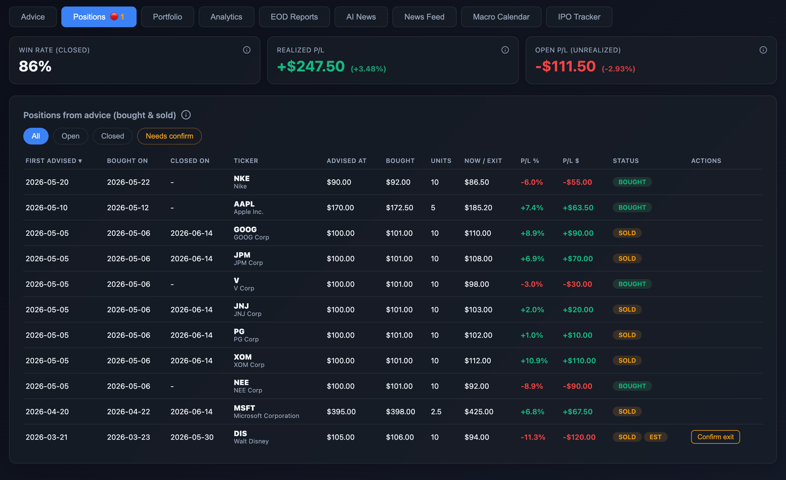
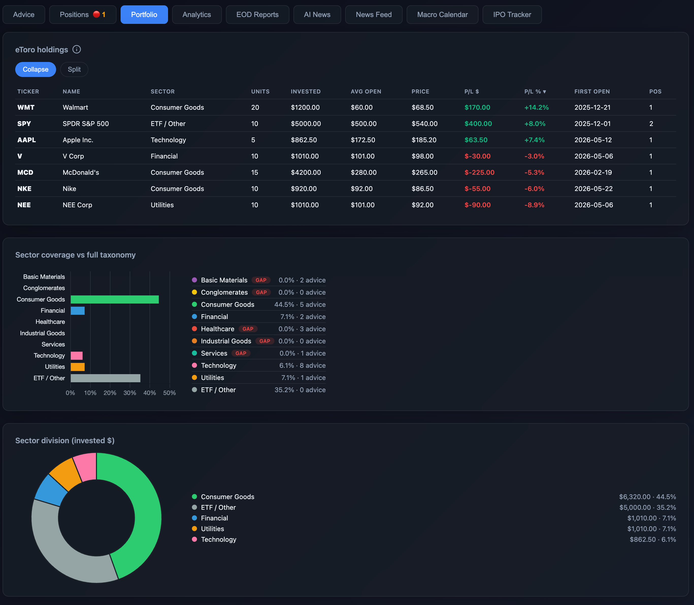
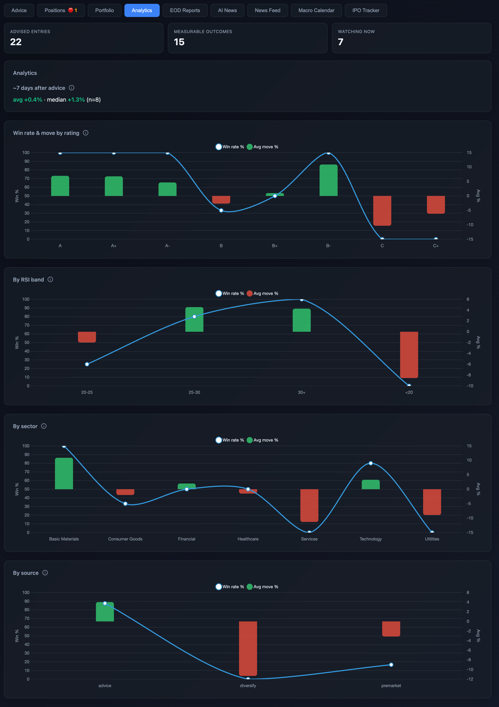
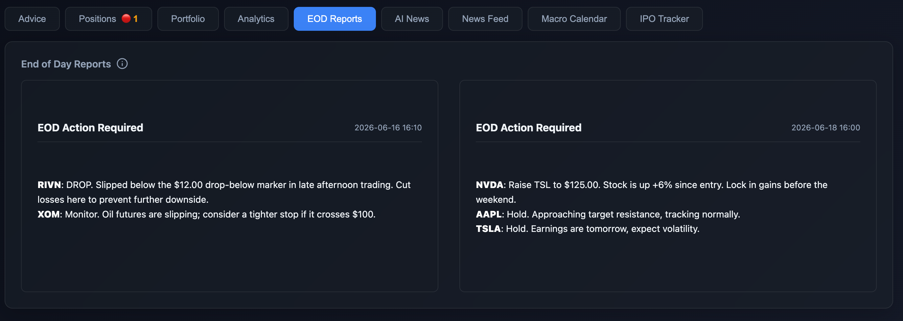
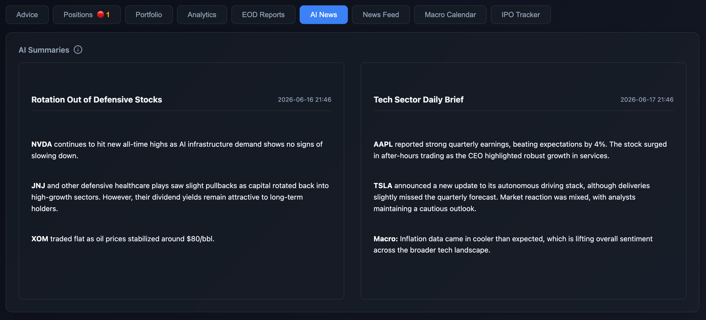
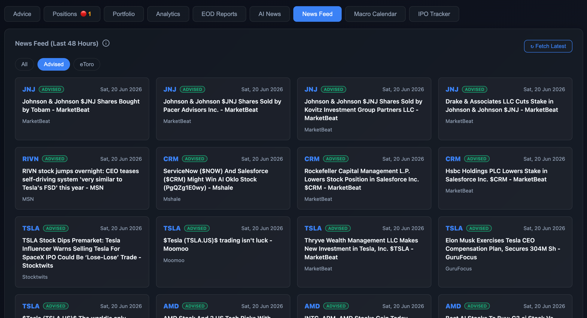
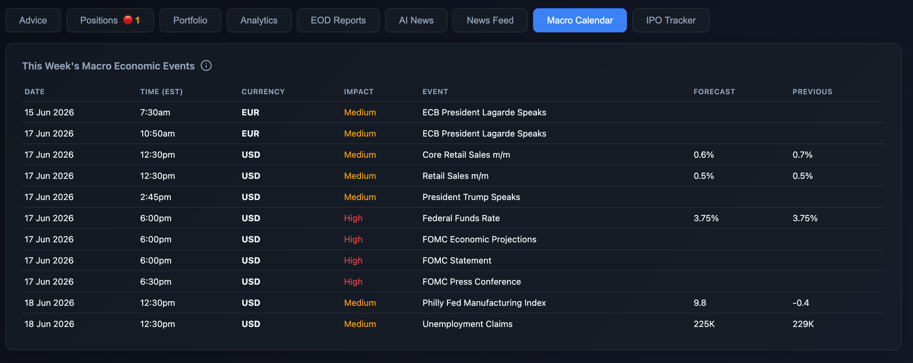
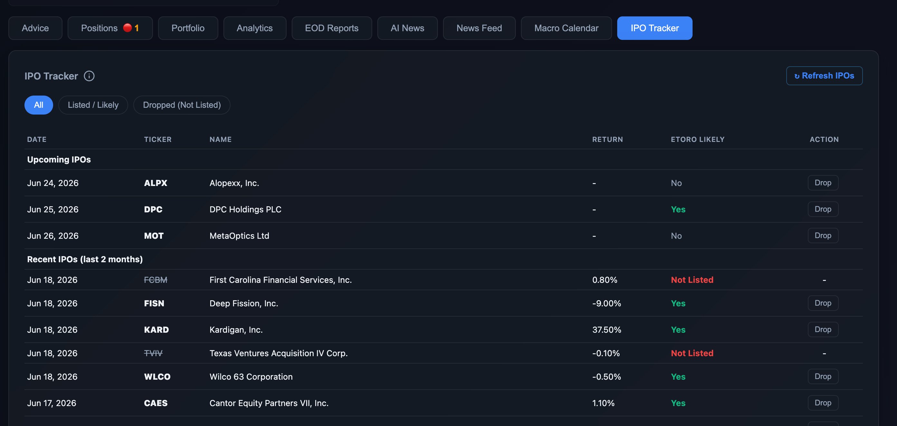

# 🖥️ The Dashboard Screens

YaraFolio features a local web interface that completely replaces complex spreadsheets. 

## 1. Advice Tab (Live Watchlist)

This is the core of the dashboard. It tracks all the stocks the AI has recommended.
- **Dynamic Tracking**: Automatically highlights whether an AI-advised stock has hit your custom "Buy Zone" (Green line) or dropped below your Stop-Loss line (Red line).
- **Deep-Dive Modals**: Click on any stock row to instantly view the AI's full research thesis, known risks, and an embedded price chart.
- **Upcoming Events**: If a tracked stock has an impending market event (like earnings), the ticker will pulse Orange to alert you.

## 2. Positions Tab

Once you actually buy a stock on eToro, the `import` script (CLI or Resync button) detects it and moves it here. 
- Tracks your **Realized** and **Unrealized (Open)** P/L specifically for AI-advised lots.
- Preserves the history of every single lot forever.
- **Action Required Badges**: A red notification dot (e.g., 🔴 1) on the tab indicates an auto-closed lot that requires your manual exit confirmation.

## 3. Portfolio Tab

A complete sync of your eToro holdings.
- **Sector Analytics**: Visualizes your entire portfolio in a pie chart to instantly expose "Sector Gaps". If you are dangerously underweighted in Healthcare, the dashboard will highlight it in Red or Orange.

## 4. Analytics Tab

Once you start closing positions (or after 7 days have passed), this tab analyzes the AI's win rate. It buckets performance by:
- Rating (A, B, C)
- RSI Band (How oversold was it?)
- Sector
- Source (Advice vs Diversify)

## 5. EOD Reports Tab

A dedicated section for End-of-Day evaluations.
- Summarizes advice on when to close low-conviction picks before the market gap overnight.

## 6. AI News Tab

A hub for AI-generated summaries.
- Quickly reads through major news events affecting your portfolio.
- Helps you spot fundamental red flags or catalysts instantly.

## 7. News Feed Tab

The raw data behind the AI summaries.
- Displays a live, unedited stream of headlines related to your tracked stocks directly from sources like Yahoo Finance.
- Fully filterable by your Advised picks or eToro holdings.

## 8. Macro Calendar Tab

Keeps you informed of large-scale market events.
- Tracks major USD/EUR announcements (like CPI releases or Fed meetings) that could increase market volatility.

## 9. IPO Tracker Tab

Monitors newly listed and upcoming initial public offerings.
- Helps identify fresh market opportunities before they hit the mainstream.
- **Market Entry**: Tickers with an IPO scheduled for today will blink Green so you don't miss the listing.
- **Noise Filtering**: You can drop an IPO from the tracker if you verify eToro won't list it. The "Listed / Likely" tab uses this to filter out noise and only show actionable IPOs.

## Features Available on Every Screen
- **Global Search:** Type any ticker or name to instantly filter the current view.
- **Live Market Timers**: A built-in countdown clock synced exactly to the New York Stock Exchange (NYSE) trading hours, tracking the Pre-Market, Open Session, and After-Hours.
- **Location Switcher**: A dropdown menu allowing you to swap between your Home or Office eToro API keys on the fly.
